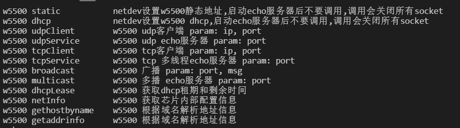

# RyanW5500

### 1、介绍

RyanW5500 实现了部分常用BSD socket API。

- BSD socket API方便上层应用移植
- 基于wizchip socket开发，优化支持RTOS，避免死循环
- dhcp自动续租
- 资源占用少
- 对接RT-Thread sal和netdev组件

### 2、设计

暂时只支持W5500，手上只有W5500。

实现中能用wizchip接口的全部使用wizchip接口，方便移植到wiz另外的芯片平台。

待补充

### 3、平台接口

暂时只支持RT-Thread，后期再考虑跨平台(比较麻烦)。

### 4、示例

使用RyanW5500软件包需要在 RT-Thread 的包管理中选中它：

- **SPI device name**：配置使用 SPI 的设备名称（用户要提前把spi设备挂载到总线上）
- **Reset PIN number**：配置设备连接的复位引脚号（根据实际使用引脚号修改）
- **IRQ PIN number**：配置设备连接的中断引脚号（根据实际使用引脚号修改）
- **Version**：软件包版本选择

详细使用请参考example，提供了一些测试接口和使用范例

下图为使用udp echo服务器和tcp echo服务器发送数据测试，

一个udp客户端 40ms轮询发送

二个tcp客户端 40 / 30ms轮询发送

结果还是蛮稳定的

### 5、依赖

- ulog组件
- SAL组件
- netdev组件
- spi
- pin

### 6、声明

无

