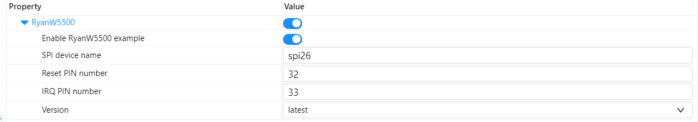
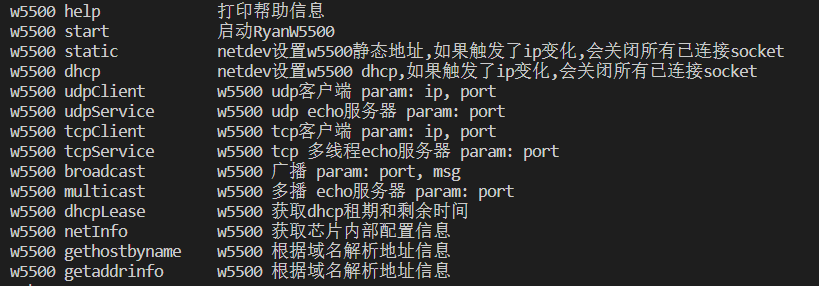
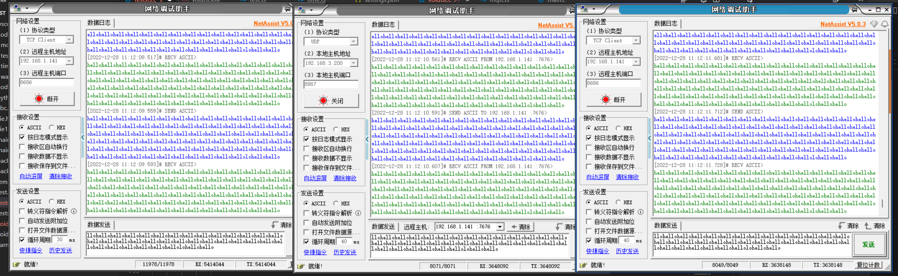

# RyanW5500

使用遇到问题可以提 issue / RT-Thread 社区提问，谢谢。

### 1、介绍

RyanW5500 实现了部分常用 BSD socket API。

- 遵循 POSIX 2017，网络标准定义
- BSD socket API 方便上层应用移植
- 基于 wizchip socket 开发，优化支持 RTOS，避免死循环
- dhcp 自动续租
- 资源占用少
- 对接 RT-Thread sal 和 netdev 组件

### 2、设计

暂时只支持 W5500，手上只有 W5500。

实现中能用 wizchip 接口的全部使用 wizchip 接口，方便移植到 wiz 其余芯片平台。

待补充

### 3、平台接口

暂时只支持 RT-Thread，后期再考虑跨平台(比较麻烦)。

### 4、示例

使用 RyanW5500 软件包需要在 RT-Thread 的包管理中选中它：

- **Enable RyanW5500 example**：配置启动 RyanW5500 示例
- **SPI device name**：配置使用 SPI 的设备名称（用户要提前把 spi 设备挂载到总线上）
- **Reset PIN number**：配置设备连接的复位引脚号（根据实际使用引脚号修改）
- **IRQ PIN number**：配置设备连接的中断引脚号（根据实际使用引脚号修改）
- **Version**：软件包版本选择（正式版没发布之前，推荐使用 latest，会及时的修复 bug）

**详细使用请参考 example，提供了一些测试接口和使用范例**

下图为使用 udp echo 服务器和 tcp echo 服务器发送数据测试，

一个 udp 客户端 40ms 轮询发送

二个 tcp 客户端 40 / 30ms 轮询发送

结果还是蛮稳定的，使用 f407cpu 占用在 20%左右，开启 dma 会更好点。

### 5、依赖

- ulog 组件
- SAL 组件
- netdev 组件
- spi
- pin

### 6、声明
